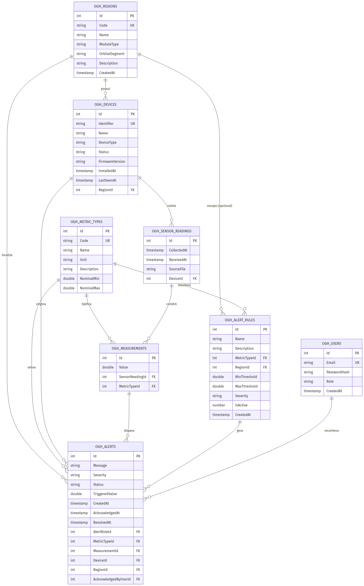
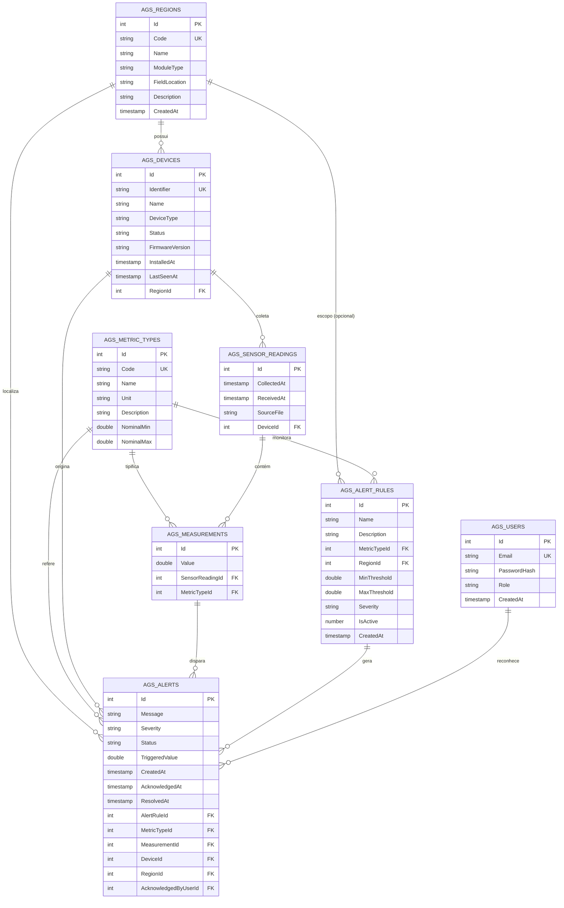

# AgroSmart — Diagrama de Entidade-Relacionamento

Banco de dados relacional (Oracle) que sustenta o monitoramento ambiental e a
gestão de alertas da produção de alimentos no espaço.

## Diagrama (imagem)

> Exportação PNG gerada a partir de [`er-diagram.mmd`](er-diagram.mmd). Para editar, altere o `.mmd` e regenere o PNG.

## Diagrama (Mermaid)

## Relacionamentos (cardinalidade)

| Relação | Tipo | Regra de negócio |
|---------|------|------------------|
| Region → Device | 1:N | Cada dispositivo pertence a uma região; uma região tem vários dispositivos. |
| Device → SensorReading | 1:N | Cada leitura (arquivo JSON) é enviada por um dispositivo. |
| SensorReading → Measurement | 1:N | Uma leitura agrupa várias medições de métricas. |
| MetricType → Measurement | 1:N | Cada medição é de um tipo de métrica do catálogo. |
| MetricType → AlertRule | 1:N | Regras monitoram uma métrica específica. |
| Region → AlertRule | 1:N (opcional) | Regra pode ser global (RegionId nulo) ou de uma região. |
| AlertRule → Alert | 1:N | Uma regra violada gera vários alertas ao longo do tempo. |
| Measurement → Alert | 1:N (opcional) | O alerta aponta a medição que o disparou (nulo se manual). |
| Device → Alert | 1:N | O alerta registra o dispositivo de origem. |
| Region → Alert | 1:N | O alerta registra a região afetada. |
| User → Alert | 1:N (opcional) | Operador que reconheceu/resolveu o alerta. |

## Regras de integridade

- `AGS_SENSOR_READINGS` e `AGS_MEASUREMENTS` usam **ON DELETE CASCADE**: apagar
  uma leitura remove suas medições; apagar um dispositivo remove suas leituras.
- `AGS_ALERTS.MeasurementId` e `AGS_ALERTS.AcknowledgedByUserId` usam
  **ON DELETE SET NULL** para preservar o histórico de alertas.
- Demais chaves estrangeiras usam **RESTRICT** (Oracle não permite múltiplos
  caminhos de cascata para a mesma tabela).
