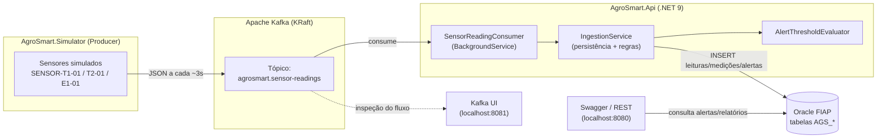
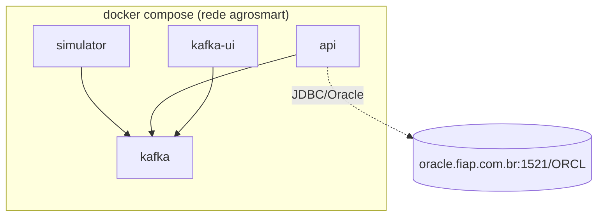

# Pipeline de Dados em Streaming (Apache Kafka)

Este documento descreve o **pipeline de dados em tempo real** da solução AgroSmart
(Requisito 1 da Fase 4) e a **arquitetura containerizada** (Requisito 2).

## Visão geral

Sensores de campo (simulados) produzem leituras continuamente. Essas leituras
trafegam por um **tópico Apache Kafka** e são consumidas pela **API AgroSmart**,
que persiste as medições no **Oracle** e avalia **regras de alerta** em tempo real.



## Componentes

| Componente | Papel no pipeline | Porta |
|------------|-------------------|-------|
| `AgroSmart.Simulator` | **Producer**: gera leituras de sensores (temperatura, umidade, umidade do solo, pH, luminosidade) e publica no tópico Kafka a cada ~3s. ~15% das amostras saem da faixa para acionar alertas. | — |
| `kafka` (apache/kafka 3.7, KRaft) | **Broker/streaming**: transporte desacoplado e durável das mensagens. | 9092 (interno) / 29092 (host) |
| `kafka-ui` | **Observabilidade**: visualiza tópicos, mensagens e consumer groups. | 8081 |
| `AgroSmart.Api` | **Consumer + transformação em valor**: o `SensorReadingConsumer` lê o stream, ingere via `IngestionService` (persiste e avalia regras) e expõe REST/Swagger. | 8080 |
| `Oracle FIAP` | **Persistência** (externo ao Docker): tabelas `AGS_*`. | 1521 |

## Formato da mensagem (payload do tópico)

```json
{
  "deviceIdentifier": "SENSOR-T1-01",
  "collectedAt": "2026-06-05T18:30:00Z",
  "measurements": [
    { "metricCode": "TEMPERATURE", "value": 35.2 },
    { "metricCode": "SOIL_MOISTURE", "value": 24.0 },
    { "metricCode": "HUMIDITY", "value": 33.0 },
    { "metricCode": "PH", "value": 7.2 }
  ]
}
```

## Por que Kafka (e não chamada HTTP direta)

- **Desacoplamento**: produtores e consumidores evoluem de forma independente.
- **Resiliência**: se a API cair, as mensagens permanecem no tópico e são processadas
  ao reconectar (offset por consumer group).
- **Escalabilidade**: múltiplos sensores/partições e múltiplas instâncias da API
  consumindo em paralelo.
- **Tempo real**: latência baixa entre coleta e geração de alertas.

## Arquitetura containerizada (Docker)

Toda a solução sobe com **um único comando** via `docker compose`. O Oracle
permanece **externo** (FIAP) — os containers só precisam de rede até `oracle.fiap.com.br`.



Ver instruções de execução no `README.md` (seção **Docker**).
